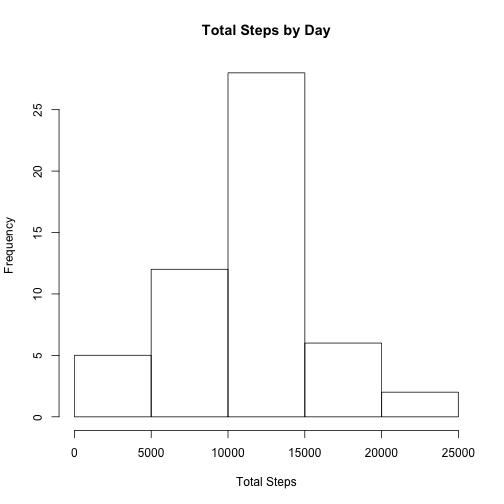
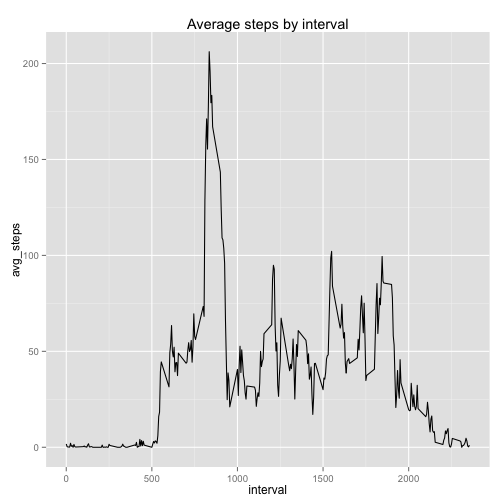
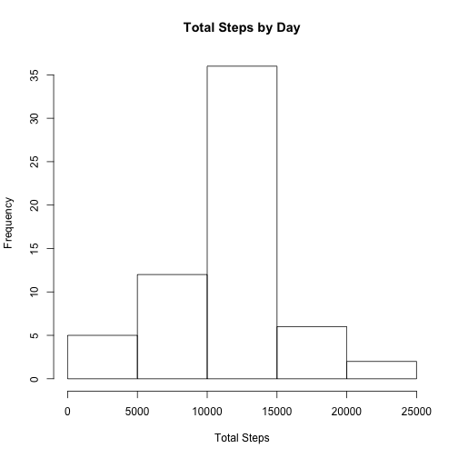
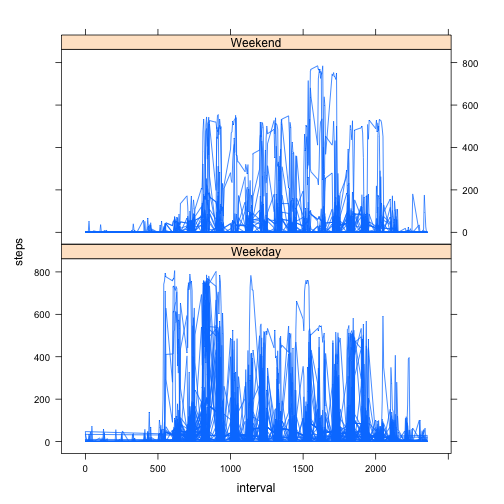

```r
library(dplyr)
library(ggplot2)
```
## Loading and preprocessing the data

```r
df <- read.csv(file = "activity.csv", sep = ",")
```


## What is mean total number of steps taken per day


```r
tb <- na.omit(df)
by_day <- group_by(tb, date)
steps_by_day <- summarise(by_day, total_steps=sum(steps))

hist(steps_by_day$total_steps, xlab = "Total Steps",  
    main = "Total Steps by Day")
```

 

```r
mean(steps_by_day$total_steps)
```

```
## [1] 10766.19
```

```r
median(steps_by_day$total_steps)
```

```
## [1] 10765
```


## What is the average daily activity pattern?


```r
by_interval <- group_by(tb, interval)
steps_by_interval <- summarise(by_interval, avg_steps=mean(steps))
qplot(interval, avg_steps, data=steps_by_interval, 
      geom="line", main = "Average steps by interval")
```

 

2. Which 5-minute interval, on average across all the days in the dataset, contains the maximum number of steps?


```r
steps_by_interval[which.max(steps_by_interval$avg_steps),]
```

```
## Source: local data frame [1 x 2]
## 
##   interval avg_steps
## 1      835  206.1698
```

## Imputing missing values

1. Calculate and report the total number of missing values in the dataset (i.e. the total number of rows with NAs)


```r
count(df) - count(tb)
```

```
##      n
## 1 2304
```
2. Devise a strategy for filling in all of the missing values in the dataset. The strategy does not need to be sophisticated. For example, you could use the mean/median for that day, or the mean for that 5-minute interval, etc.


```r
fillNAs <- function (df, steps_by_interval){
  for(i in 1:nrow(df)) {
    row <- df[i,]
     if(is.na(row$steps)){
        row$steps <- steps_by_interval[steps_by_interval$interval==row$interval,]$avg_steps
        df[i,] <- row
      }
  }
  df
}
```
3. Create a new dataset that is equal to the original dataset but with the missing data filled in.

```r
dfNoNAs <- fillNAs(df, steps_by_interval)
```

4. Make a histogram of the total number of steps taken each day and Calculate and report the mean and median total number of steps taken per day. 


```r
by_day_NoNAs <- group_by(dfNoNAs, date)
steps_by_day_NoNAs <- summarise(by_day_NoNAs, total_steps=sum(steps))

hist(steps_by_day_NoNAs$total_steps, xlab = "Total Steps",  
    main = "Total Steps by Day")
```

 

```r
mean(steps_by_day_NoNAs$total_steps)
```

```
## [1] 10766.19
```

```r
median(steps_by_day_NoNAs$total_steps)
```

```
## [1] 10766.19
```
4.1 Do these values differ from the estimates from the first part of the assignment?  
  + barely...

4.2 What is the impact of imputing missing data on the estimates of the total daily number of steps?  
  + they're a little bit different. The top frequency increased to 35

## Are there differences in activity patterns between weekdays and weekends?

```r
dfNoNAs$day <- weekdays(as.Date(dfNoNAs$date))

dfNoNAs$day <- ifelse(dfNoNAs$day == "Sunday" | dfNoNAs$day == "Saturday", "Weekend","Weekday")

dfNoNAs$day <- as.factor(dfNoNAs$day)
```
2. Make a panel plot containing a time series plot (i.e. type = "l") of the 5-minute interval (x-axis) and the average number of steps taken, averaged across all weekday days or weekend days (y-axis). See the README file in the GitHub repository to see an example of what this plot should look like using simulated data.


```r
by_weekday <- aggregate(steps ~ interval + day, dfNoNAs, mean)
library(lattice)
xyplot(steps ~ interval | factor(day), data = dfNoNAs, aspect = 1/2, 
    type = "l")
```

 
